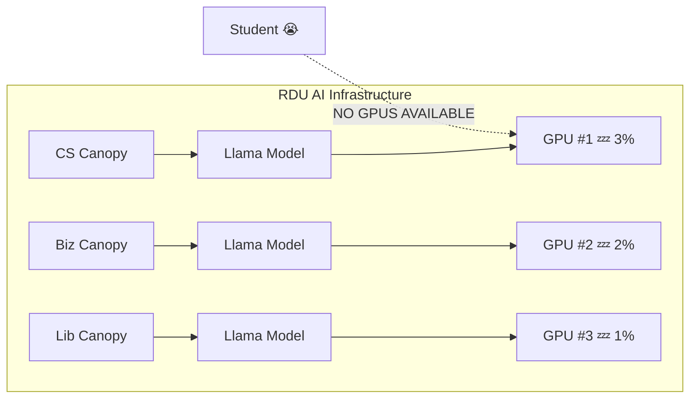
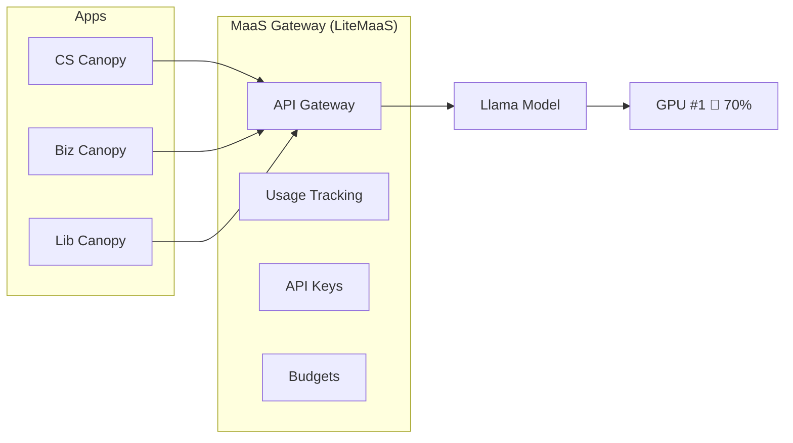
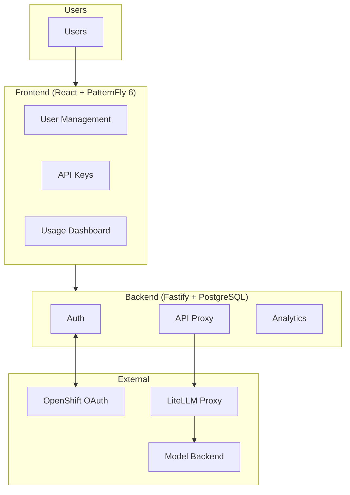

# 🧠 MaaS 이해하기: 기원 이야기

> 🎩 **페르소나 포커스: 오너(Owner)** — 이 레슨에서는 비용을 지불하는 사람이 되어 "왜 우리 GPU는 항상 0% 사용률인데 사람들은 GPU를 못 구한다고 불만을 제기할까?"라고 생각해보게 됩니다.

---

## 🏫 RDU의 문제

Canopy는 대성공이었습니다! 캠퍼스 전체의 화제가 되는 데는 그리 오랜 시간이 걸리지 않았습니다! 이제:

* 🖥️ **CS 학과**: "입문 프로그래밍 과목을 위해 Canopy 같은 서비스가 필요합니다!"
* 📊 **경영대학원**: "분석 커리큘럼을 위해 AI가 필요합니다!"
* 📚 **도서관**: "학생들이 연구 데이터베이스를 탐색하도록 돕는 어시스턴트가 필요합니다!"

모범적인 구성원답게, 각 학과는 여러분이 배운 것과 동일한 패턴을 따릅니다: 클라우드 모델에 접근하거나(💸💸💸) KServe/vLLM을 사용해 직접 모델을 배포하고, 애플리케이션을 연결하면 끝!

**결과는?**

동일한 모델 세 개. GPU 세 개. 합산 사용률: 6%.

그런데 학생이 머신러닝 프로젝트를 위해 GPU를 띄우려고 하면? **"사용 가능한 리소스가 없습니다."**

---

## 🏢 엔터프라이즈 규모로 확장하기

대학 수준에서도 이렇게 나쁘다면, 엔터프라이즈 규모에서는 어떤 일이 벌어질지 상상해보세요.

큰 회사(절대 Red Hat은 아닙니다 😉)가 1만 9천 명의 전 직원에게 OpenShift AI 접근 권한을 줘서 AI를 민주화하기로 결정했다고 해봅시다. "모두가 각자의 모델을 배포할 수 있습니다! 모두를 위한 혁신!"

**실제로 벌어지는 일:**

| 날 | 사건 | GPU 개수 |
|-----|-------|-----------|
| 월요일 | 개발자 7명이 Llama 3B를 배포할 수 있다는 것을 발견함 | GPU 7개 할당됨 |
| 화요일 | GPU 7개가 모두 0% 사용률로 대기 중 (개발자들은 회의 중) | GPU 7개... 대기 중 |
| 수요일 | 마케팅팀이 접근 권한을 요청함 | "사용 가능한 GPU 없음" |
| 목요일 | 재무팀이 긴급 AI 프로젝트 요청을 제출함 | "사용 가능한 GPU 없음" |
| 금요일 | 누군가 티켓을 엶: "왜 GPU를 하나도 못 받는 거죠?" | 개발자 7명: "내 거야!" 🐿️ |

모두가 자신만의 모델 인스턴스를 배포할 수 있게 되면, 실제로 그렇게 할 것입니다—그리고 사용하지 않더라도 절대 내놓지 않을 것입니다.

---

## 🚫 통하지 않는 아이디어들

오너는 "분명 쉬운 해결책이 있지 않을까?"라고 생각할 수 있습니다. 옵션들을 살펴봅시다:

### ❌ 옵션 1: "그냥 GPU를 더 사자!"

| 접근법 | 문제 |
|----------|---------|
| 오토스케일링 최대치를 늘림 | GPU는 개당 1만~4만 달러입니다. 1만 9천 명의 직원 × 0.1 GPU만 해도 = 💸💸💸 |
| 노드를 더 추가함 | 여전히 중복 문제는 해결되지 않음—이제 Llama 인스턴스가 14개로 늘어났을 뿐 |

**결과:** 클라우드 비용 담당팀을 매우 불행하게 만들었습니다.

### ❌ 옵션 2: "쿼터를 설정하자!"

| 접근법 | 문제 |
|----------|---------|
| 사용자별 OpenShift 쿼터 | 중복을 막지 못함—작은 쿼터를 가진 사용자 7명이어도 여전히 모델 7개 |
| 시간 기반 제한 | 사용자들은 제한이 만료되면 그냥 다시 배포함 |

**결과:** 관료적 절차는 늘었지만 효율성은 늘지 않았습니다.

### ❌ 옵션 3: "MIG로 GPU를 나누자!"

| 접근법 | 문제 |
|----------|---------|
| NVIDIA MIG 파티셔닝 | 조각이 최신 LLM에 비해 너무 작음 |
| 더 작은 모델 | 목적을 무너뜨림—사용자들은 좋은 모델을 원함 |

**결과:** 모두를 불행하게 만들었고, 모델도 들어가지 않습니다.

---

## 💡 MaaS 솔루션: 깨달음의 순간

만약... 모든 사람에게 *GPU*에 대한 접근 권한을 주는 대신, *모델*에 대한 접근 권한을 준다면 어떨까요?

MaaS 접근법:

| 이전 (셀프서비스 GPU) | 이후 (Models as a Service) |
|---------------------------|----------------------------|
| 사용자 7명이 Llama 인스턴스 7개를 배포함 | 전문가 팀 1개가 Llama 인스턴스 1개를 배포함 |
| GPU 7개가 각각 3% 사용률 | GPU 1개가 70% 이상 사용률 |
| "사용 가능한 GPU 없음" 오류 | 모두가 즉시 API 접근 권한을 얻음 |
| 사용량에 대한 가시성 없음 | 사용자/팀별 전체 사용량 추적 |
| 비용 귀속 없음 | 부서별 차지백(chargeback) |

**아키텍처:**

---

## 🎯 MaaS 원칙

### 1️⃣ 프라이빗 AI의 제공자가 되자

모두가 각자 알아서 하는 대신, 전담 팀이 AI를 내부 서비스로 제공합니다. 이들은 조직을 위한 "프라이빗 AI 제공자"가 됩니다.

### 2️⃣ 문제에 GPU만 쏟아붓지 말자

전략 없이 GPU만 늘리는 것 = 낭비만 늘어나는 것. MaaS는 단순한 *용량*이 아니라 *사용률*에 집중합니다.

### 3️⃣ 각 모델을 한 번만 배포하고, 많이 서빙하자

전문가 팀이 각 모델을 배포하고 최적화합니다. 사용자는 API를 통해 사용합니다. 모두가 이득을 봅니다.

### 4️⃣ 퍼블릭 AI 제공자 모델을 그대로 가져오자

AWS Bedrock, Azure OpenAI, Google Vertex — 모두 이런 방식으로 동작합니다. MaaS는 같은 패턴을 여러분의 프라이빗 인프라에 가져옵니다.

### 5️⃣ 큰 GPU 비용에는 큰 비용 추적이 따라야 한다

측정할 수 없으면 관리할 수도 없습니다. MaaS는 누가 무엇을 사용하는지에 대한 완전한 가시성을 제공합니다.

---

## 🏗️ LiteMaaS 소개

이 모듈에서는 **LiteMaaS**—경량의 오픈소스 Models-as-a-Service 개념 증명 애플리케이션—을 사용합니다

**핵심 구성 요소:**

| 구성 요소 | 기술 | 목적 |
|-----------|------------|---------|
| **Frontend** | React + PatternFly 6 | 아름답고 접근성이 좋은 관리자 및 사용자 UI |
| **Backend** | Fastify + Node.js | 빠르고 현대적인 API 서버 |
| **Database** | PostgreSQL | 사용자, API 키, 사용량 데이터, 감사 로그 |
| **Proxy** | LiteLLM | 여러 백엔드에 걸친 OpenAI 호환 API |
| **Auth** | OAuth2/JWT | OpenShift 통합, 매끄러운 SSO |

**왜 LiteMaaS인가?**

* ✅ 오픈소스이며 확장 가능함
* ✅ OpenAI 호환 API (기존 도구들과 함께 동작함)
* ✅ 3단계 역할 계층 구조: admin → adminReadonly → user
* ✅ 내장된 사용량 추적 및 예산 기능
* ✅ OpenShift 환경을 위해 설계됨

---

## 🧪 지식 확인

계속 진행하기 전에, 핵심 개념이 명확한지 확인해봅시다:

❓ 왜 "모두에게 GPU 접근 권한을 주는 것"이 규모가 커지면 문제가 될까요?

✅ **답:** 모두가 자신의 모델 인스턴스를 배포할 수 있게 되면, 실제로 그렇게 합니다—그 결과 중복 배포, 낮은 사용률, 리소스 고갈이 발생합니다. 동일한 Llama 인스턴스 7개를 가진 7명 = GPU 7개가 각각 3% 사용률인 반면, 다른 사람들은 GPU 접근 권한을 전혀 얻지 못합니다.

❓ GPU 접근과 모델 접근의 핵심적인 차이는 무엇인가요?

✅ **답:** GPU 접근은 사용자가 원하는 것을 자유롭게 배포하게 합니다(중복을 초래함). 모델 접근은 사용자가 API를 통해 이미 배포된 모델을 *사용*하게 합니다(공유와 효율성을 초래함). 사용자에게는 GPU가 필요한 것이 아니라—모델의 기능이 필요한 것입니다.

❓ MaaS 구현에서 핵심 페르소나는 누구인가요?

✅ **답:**
- 🎩 **오너(Owner)** — 비용과 효율성에 관심
- 🔧 **AI 엔지니어** — 인프라를 배포하고 관리
- 👩‍💼 **서비스 관리자** — 사용자, 접근 권한, 예산을 관리
- 👤 **소비자(Consumer)** — API를 사용해 애플리케이션을 구축

MaaS가 *왜* 존재하는지 이해했으니, 이제 직접 만들어볼 시간입니다!

다음 레슨에서는 🔧 **AI 엔지니어** 모자를 쓰고 OpenShift에 LiteMaaS를 배포하게 됩니다.
