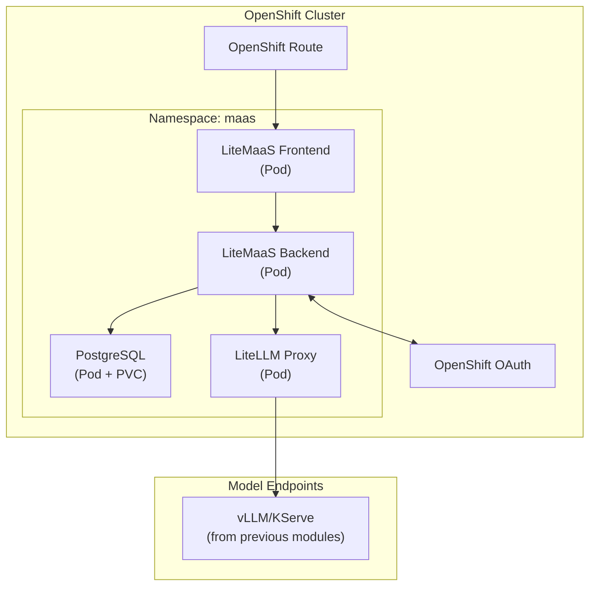

# 🚀 LiteMaaS 배포하기

> 🔧 **페르소나 포커스: AI 엔지니어** — 이제 인프라 담당자의 모자를 쓸 시간입니다! 여러분은 모델을 한 번 배포해서 다른 모든 사람이 혜택을 볼 수 있게 하는 전문가입니다. 다른 모든 사람이 그냥 수도꼭지를 틀면 되도록 정수 처리장을 짓는 사람이라고 생각하세요.

---

## 🎯 무엇을 만들 것인가

이 레슨을 마치면, OpenShift에서 완전히 동작하는 LiteMaaS 배포를 갖게 됩니다:



---

## ✅ 사전 준비 사항 확인

시작하기 전에, 모든 것이 준비되어 있는지 확인해봅시다. 워크스페이스로 돌아가서 터미널에서 아래 명령어들을 실행하세요.

### 1. OpenShift 접근

클러스터에 접근할 수 있는지 확인합니다:

  ```bash
  export CLUSTER_DOMAIN=<CLUSTER_DOMAIN>
  oc login --server=https://api.${CLUSTER_DOMAIN##apps.}:6443 -u <USER_NAME> -p <PASSWORD>
  ```

### 2. 기존 모델 엔드포인트

LiteMaaS는 모델에 대한 *게이트웨이*입니다. 자체적으로 모델을 배포하지는 않습니다. 지금까지 사용해온 모델들을 이 게이트웨이 뒤에 둘 것입니다:

  ```bash
  # Check if you have model inference services running
  oc get inferenceservices -n ai501
  ```

여러분의 Llama-3.2 3b(클라우드 모델)와 양자화된 Llama가 가드레일 모델들과 함께 보일 것입니다. 그리고 여러분 자신의 실험 환경을 확인하면 Tiny Llama가 보일 것입니다:

  ```bash
  # Check if you have model inference services running
  oc get inferenceservices -n <USER_NAME>-canopy
  ```

### 3. 네임스페이스 준비

이 실습에서는 LiteMaaS를 전용 프로젝트에 배포할 것입니다:

```bash
# Create the maas project 
oc new-project <USER_NAME>-maas
```

---

## 📦 1단계: LiteMaaS 리포지토리 클론하기

LiteMaaS 코드를 가져옵시다:

  ```bash
  cd /opt/app-root/src
  git clone https://github.com/rh-aiservices-bu/litemaas.git
  cd litemaas
  ```

잠시 시간을 내서 구조를 살펴보세요:

```bash
litemaas/
├── frontend/         # React + PatternFly UI
├── backend/          # Fastify API server
├── deployment/       # Deployment recipes
│   ├── helm/         # Helm recipe
│   └── kustomize/    # Kustomize recipe
├── docker/           # Container build files
└── docs/             # Additional documentation
```

---

## ⚙️ 2단계: 배포 구성하기

Helm 레시피를 사용해서 몇 가지 설정 값과 함께 LiteMaaS를 배포하겠습니다.

`litemaas/deployment/helm/litemaas` 폴더 아래에서, `values.yaml` 파일의 복사본을 만드세요:

```bash
cd deployment/helm/litemaas
cp values.yaml my-values.yaml
```

파일을 편집해서 모든 `changeme` 필드를 더 견고한 비밀번호로 수정하세요.

> ⚠️ **참고:** 실제 배포에서는 적절한 시크릿 관리(예: External Secrets Operator, Vault)를 사용해야 합니다. 지금은 단순하게 유지하지만, 이 주제는 곧 다루게 될 것입니다 :)

---

## 🚀 3단계: OpenShift에 배포하기

이제 재미있는 부분입니다 — 배포해봅시다!

1. 여전히 `litemaas/deployment/helm/litemaas` 폴더에 있습니다.
2. 배포를 시작하기 위해 배포 명령어를 실행합니다:

```bash
helm install litemaas . \
-n <USER_NAME>-maas \
-f my-values.yaml \
--set route.enabled=true \
--set backend.nodeTlsRejectUnauthorized="0"
```

몇 초 후 다음과 같은 출력을 받게 됩니다:

```bash
I0212 10:22:02.565638   55774 request.go:655] Throttling request took 1.087707749s, request: GET:https://...:6443/apis/export.kubevirt.io/v1alpha1?timeout=32s
I0212 10:22:12.765641   55774 request.go:655] Throttling request took 11.287628662s, request: GET:https://...:6443/apis/kyverno.io/v2beta1?timeout=32s
I0212 10:22:22.765647   55774 request.go:655] Throttling request took 21.287555267s, request: GET:https://...:6443/apis/odf.openshift.io/v1alpha1?timeout=32s
NAME: litemaas
LAST DEPLOYED: Thu Feb 12 10:22:30 2026
NAMESPACE: <USER_NAME>-maas
STATUS: deployed
REVISION: 1
TEST SUITE: None
NOTES:
LiteMaaS has been deployed successfully!

Components:
  - PostgreSQL:  litemaas-postgresql:5432
  - LiteLLM:     litemaas-litellm:4000
  - Backend:     litemaas-backend:8080
  - Frontend:    litemaas:8080

OAuth mode: serviceaccount
  Client ID:  system:serviceaccount:<USER_NAME>-maas:litemaas
  Token secret: litemaas-oauth-token
  NOTE: No OAuthClient CR needed — the ServiceAccount acts as the OAuth client.
  A post-install hook will auto-configure the OAuth redirect URI and backend
  secrets from the Route hostname. The backend may restart once after install.

Initial admin users: <USER_NAME>
  (Auto-detected from deploying user)

Access the application via OpenShift Routes:
  kubectl get routes -n <USER_NAME>-maas
  LiteLLM:  kubectl get route litemaas-litellm -n <USER_NAME>-maas -o jsonpath='{.spec.host}'

Post-deployment:
  1. Configure AI models via LiteMaaS or LiteLLM admin UI
  2. Wait for backend to sync models, or restart the backend deployment
```
3. 모든 테이블이 초기화되도록 환경 변수 `DISABLE_SCHEMA_UPDATE`를 `false`로 설정합니다:

```bash
oc set env deployment/litemaas-litellm DISABLE_SCHEMA_UPDATE=false -n <USER_NAME>-maas
```

4. 네 개의 파드가 모두 up and running 상태가 될 때까지(Ready 열 아래 `1/1`) 배포를 지켜보세요

```bash
# Watch pods come up
oc get pods -n <USER_NAME>-maas -w
```

다음 파드들이 보일 것입니다:

- `postgresql-*` — 데이터베이스 파드
- `litemaas-backend-*` — API 서버
- `litemaas-frontend-*` — React UI
- `litellm-*` — OpenAI 호환 프록시


`Ctrl + C`를 눌러서 watch를 중단합니다.

---

## ✨ 4단계: LiteMaaS UI 접근하기

1. 브라우저를 열고 다음 주소로 이동합니다:

```
https://litemaas-<USER_NAME>-maas.<CLUSTER_DOMAIN>
```

LiteMaaS 로그인 페이지가 보일 것입니다! OpenShift 자격 증명을 사용해 로그인하세요!


기본적으로 관리자 권한을 가지고 있습니다. 그래서 왼쪽에 `Administrator` 섹션이 보이지만, 다른 사용자들은 이를 볼 수 없습니다. 하지만 여러분도 일반 사용자로서 LiteMaaS를 사용할 수 있습니다. 하지만 먼저, 모델을 몇 개 추가해야 합니다!

---

## 🔗 5단계: 모델 연결 구성하기

LiteMaaS는 백엔드 프록시로 [LiteLLM](https://github.com/BerriAI/litellm)을 사용합니다. LiteLLM에게 사용 가능한 모델들에 대해 알려줘야 합니다.

1. 먼저 초기 클라우드 모델을 첫 번째로 추가해봅시다. `Administator` > `Model Management`로 이동해서 `Create Model`을 클릭합니다.

  

2. 아래와 같이 폼을 채웁니다:

  **Model Name:** `Llama-3.2-3B`

  **Description:** `Meta Llama 3.2 3B is a lightweight 3B-parameter, multilingual text-only LLM`

  **API Base URL:** `http://llama-32-predictor.ai501.svc.cluster.local:8080/v1`

  **Backend Model Name:** `llama32`  

  **API Key:** `fakekey`

  **Input Cost per Million Tokens:** `0,1`

  **Output Cost per Million Tokens:** `0,5` (또는 비용 값은 여러분의 상상력을 발휘해도 됩니다 💸💸💸)

  **Features:** `Supports Function Calling`와 `Supports Tool Choice`를 선택할 수 있습니다


  

  나머지는 기본값으로 두고 `Create`를 누르세요

  

3. MaaS를 통해 사용할 수 있도록 `TinyLlama`와 양자화된 `llama32-fp8`도 MaaS에 추가해봅시다.

  다음 옵션들을 사용해서 추가할 수 있습니다:

  <details>
  <summary>TinyLLama 🦙</summary>

    **Model Name:** `TinyLlama-1.1B`

    **Description:** `TinyLlama is a compact 1.1B parameter language model`

    **API Base URL:** `http://tinyllama-predictor.<USER_NAME>-canopy.svc.cluster.local:8080/v1`

    **Backend Model Name:** `tinyllama`  

    **API Key:** `fakekey`

    **Input Cost per Million Tokens:** `0,001`

    **Output Cost per Million Tokens:** `0,005`

    _이것에 대해서도 비용을 청구해야 할까요?_ 🫣🫣🫣

  </details>

  <details>
  <summary>Llama-3.2-3B-Instruct-FP8 🦙🦙</summary>

    **Model Name:** `Llama-3.2-3B-Instruct-FP8`

    **Description:** `Meta Llama 3.2 3B Instruct quantized to FP8 for efficient inference`

    **API Base URL:** `http://llama-32-fp8-predictor.ai501.svc.cluster.local:8080/v1`

    **Backend Model Name:** `llama32-fp8`  

    **API Key:** `fakekey`

    **Input Cost per Million Tokens:** `0,01`

    **Output Cost per Million Tokens:** `0,05`

    **Features:** `Supports Function Calling`와 `Supports Tool Choice`를 선택할 수 있습니다
  </details>

  

인프라가 준비됐습니다! 이제 Canopy가 이 MaaS 인스턴스로부터 모델을 사용하도록 만들어봅시다!
