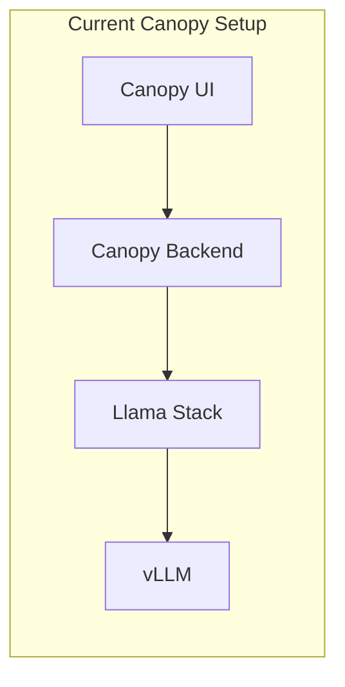
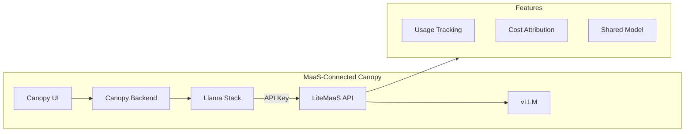

# 🌳 Canopy 통합

> 🌳 **페르소나 포커스: 모두** — 모든 것이 하나로 모이는 순간입니다! Canopy는 지금까지 모델 엔드포인트와 직접 대화하고 있었습니다. 이제 MaaS를 사용하도록 업그레이드할 시간입니다.


## 🎬 이전과 이후

무엇이 바뀌는지 시각화해봅시다:

### 이전



### 이후



이제 Canopy는 LiteMaaS를 거쳐가며, 다음을 제공받습니다:
* ✅ 중앙화된 사용량 추적
* ✅ 비용 귀속
* ✅ API 키 관리
* ✅ 공유 모델 접근

---

## 🔐 1단계: Canopy를 위한 API 키 만들기

먼저, Canopy 실험을 위한 전용 API 키를 만들어봅시다.

### 왜 전용 키가 필요한가?

| 접근법 | 문제 |
|----------|---------|
| 개인 키 사용 | Canopy 사용량을 여러분의 실험과 구분할 수 없음 |
| 팀과 키 공유 | 누가 무엇을 사용하는지 알 수 없음, 책임 소재가 불명확함 |
| **전용 앱 키** | ✅ 명확한 추적, 쉬운 키 교체, 구체적인 예산 |

1. 먼저, `Models` 아래에서 `Llama-3.2-3B-Instruct-FP8` 모델을 구독해봅시다. 클릭한 뒤 `Subscribe`를 누르세요

  

2. 구독에 성공하면, `API Keys`로 이동해서 방금 구독한 모델에 대한 API 키를 만듭니다!

  API 키에 `canopy-experiments` 같은 이름을 주고, `API Key to be used in the experiment environment`와 같이 좋은 설명을 작성하세요.

  

  `sk-abcdxxx`와 비슷한 형태의 키가 생성될 것입니다

1. 키를 복사한 후, 화면을 닫고 `View Key`를 클릭해서 API 엔드포인트에 대한 더 자세한 정보와 사용 예시를 확인하세요.

  오른쪽 구석에 있는 눈 👁️ 아이콘인 `Show key`를 클릭하면, 사용 예시가 여러분의 키로 업데이트된 것을 볼 수 있습니다. 그런 다음 그 사용 예시를 복사해서 터미널에 붙여넣어, 생성된 키로 모델 엔드포인트에 접근할 수 있는지 확인하세요.

  

  


## ⚙️ 2단계: Canopy 설정 업데이트하기

이제 Llama Stack이 직접 엔드포인트 대신 LiteMaaS를 사용하도록 알려줘야 합니다.

1. Llama Stack 입장에서는, 이것은 그냥 게이트웨이를 통해 서빙되는 또 다른 모델 엔드포인트일 뿐입니다. 지금까지 해왔던 것처럼 helm 릴리스를 업그레이드해서 이 또 다른 모델 엔드포인트를 추가해봅시다.

  `<USER_NAME>-canopy` 네임스페이스에서, `Helm` > `Release` > `llama-stack-operator-instance` > Upgrade로 이동하세요. Form view에서, `models` 아래, `Add models`를 클릭하고 LiteMaaS에서 얻은 아래 정보를 추가합니다:

  name: `Llama-3.2-3B-Instruct-FP8`

  url: `https://litemaas-litellm-<USER_NAME>-maas.<CLUSTER_DOMAIN>/v1`

  token: `your-token-sk-xxxx`  (LiteMaaS에서 복사하세요)

  

## 🌳 3단계: Canopy Backend 업데이트하기

이전에 여러 번 해왔던 것처럼, Canopy backend 설정이 Llama Stack 설정에 새로 추가된 이 모델을 사용하도록 업데이트해봅시다.

1. **OpenShift Console** → **Helm** → **Releases**에서 `canopy-backend`를 찾으세요


2. `llama32-fp8`로 되어 있는 부분을 모두 MaaS가 제공하는 버전의 모델로 바꿔야 합니다 :) 예를 들어, `summarize`의 경우:

    ```yaml
    summarization:
      enabled: true
      endpoint: 'http://llama-stack-service:8321/v1'
      max_tokens: 2048
      mlflow_prompt: summarization
      mlflow_prompt_version: latest
      model: vllm-Llama-3.2-3B-Instruct-FP8/Llama-3.2-3B-Instruct-FP8 # 👈 Update this  ❗︎❗️❗️❗️
    ```

3. 변경 사항을 적용하려면 **Upgrade**를 클릭합니다.

4. Topology view에서 모든 것이 파란색이 되면, Canopy UI로 이동해서 모든 것이 잘 동작하는지 확인하세요. 그런 다음 `test`와 `prod` 환경에서도 이를 반복하되, GitOps를 통해 진행합니다.

  여기 Canopy UI 링크가 있습니다:

  ```bash
  https://canopy-ui-<USER_NAME>-canopy.<CLUSTER_DOMAIN>/
  ```

  실제로, GitOps 관련 부분으로 넘어가기 전에, 이 키를 기반으로 한 모델 사용량을 빠르게 모니터링해봅시다.

---

### 📊 4단계: 사용량 추적하기

책임감 있는 개발자(그리고 예산에 신경 쓰는 사람)로서, 얼마나 사용하고 있는지 알고 싶을 것입니다. Canopy UI로 이동해서 더 많은 프롬프트와 요청을 보내고, 대시보드로 돌아와서 값을 관찰해보세요.

  

---

## 🧪 지식 확인

<details>
<summary>❓ 왜 각 애플리케이션은 자체 API 키를 가져야 할까요?</summary>

✅ **답:** 별도의 API 키는 다음을 제공합니다:
- 애플리케이션별 명확한 사용량 추적
- 애플리케이션별 개별 예산
- 다른 앱에 영향을 주지 않는 쉬운 키 교체
- 다른 앱에 영향을 주지 않고 하나의 앱 접근만 취소할 수 있는 능력
</details>

<details>
<summary>❓ LiteMaaS에서 Canopy 사용량을 보는 것의 이점은 무엇인가요?</summary>

✅ **답:** 이제 다음을 할 수 있습니다:
- Canopy 운영에 드는 비용 추적
- 여러 애플리케이션 간 사용량 비교
- API 키별 예산 및 알림 설정
- 확장에 대한 데이터 기반 의사결정
- 특정 애플리케이션 및 사용자에게 비용 귀속

</details>

---

이상적으로는, 다음 단계는 지금까지 논의한 모든 이점을 위해 `test`, 그리고 `prod` 환경도 MaaS를 통해 모델을 사용하도록 만드는 것입니다. 하지만 이미 짐작했겠지만, 이러한 상위 환경에서는 GitOps를 철저히 따르며, API 키도 `코드로서` 저장해야 합니다. 그런데 API 키를 git에 push하면 안 되죠? 그렇다면 어떻게 해야 할까요?

MaaS에서 잠깐 벗어나서 GitOps에서의 시크릿 관리(Secret Management)를 간단히 소개해봅시다.

---