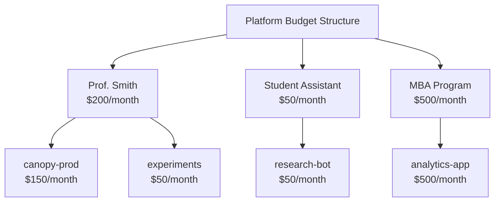

# WIP 

# 👩‍💼 관리자 설정

> 👩‍💼 **페르소나 포커스: 서비스 관리자** — 여러분은 MaaS 플랫폼의 친근한 얼굴입니다. 사용자들은 접근 권한이 필요할 때, 뭔가 고장났을 때, 또는 모델이 자기 고양이에 대한 시를 쓰는 것을 지켜보다 토큰 예산을 다 써버렸을 때 여러분을 찾아옵니다. 여러분의 역할은: 모두가 지원받고 있다고 느끼게 하면서 모든 것이 원활하게 돌아가도록 유지하는 것입니다.

---

## 🎯 배울 내용

이 레슨에서는 서비스 관리자로서 LiteMaaS를 설정하게 됩니다:

* 👥 사용자 관리 및 역할 할당
* 🤖 사용자가 접근할 수 있는 모델 설정
* 💰 통제 불능 비용을 막기 위한 예산 설정
* 🔑 API 키 생명주기 이해하기

---

## 👥 사용자 관리

### 역할 이해하기

LiteMaaS는 3단계 역할 계층 구조를 사용합니다:

| 역할 | 접근 수준 | 일반적인 사용 사례 |
|------|-------------|-------------|
| **admin** | 전체 접근 | 플랫폼 소유자, IT 책임자 |
| **adminReadonly** | 모든 것을 보되, 아무것도 수정하지 않음 | 감사자, 보안팀, 관리자 |
| **user** | 셀프서비스만 | 개발자, 데이터 과학자, 최종 사용자 |

[Image: Role hierarchy pyramid showing:
- Top: admin (crown icon) - "Full control over platform"
- Middle: adminReadonly (eye icon) - "Can see everything, change nothing"
- Bottom: user (person icon) - "Self-service: API keys, personal usage, playground"]

### 실습: 사용자 보기

1. 관리자로 LiteMaaS에 로그인합니다
2. 왼쪽 사이드바에서 **Users**로 이동합니다
3. 자신이 admin으로 목록에 표시되는 것을 볼 수 있습니다

[Image: Users list page showing a table with columns: Username, Email, Role, Status, Last Login, Actions]

### 실습: 사용자의 역할 수정하기

동료가 admin 수준의 가시성은 필요하지만 설정을 변경할 수는 없어야 하는 상황을 가정해봅시다. `adminReadonly`에 완벽한 사용 사례입니다:

1. 사용자의 행(또는 편집 아이콘)을 클릭합니다
2. 역할 드롭다운에서 **adminReadonly**를 선택합니다
3. **Save**를 클릭합니다

[Image: User edit modal showing:
- User info fields (readonly)
- Role dropdown with options: admin, adminReadonly, user
- Status toggle (Active/Inactive)
- Save/Cancel buttons]

> 💡 **꿀팁:** 사용자에게는 필요한 최소한의 권한부터 시작하세요. 나중에 언제든지 업그레이드할 수 있습니다!

---

## 🤖 모델 관리

서비스 관리자로서, 사용자가 접근할 수 있는 모델을 통제합니다. 모든 모델이 모두에게 제공되어야 하는 것은 아닙니다 — 일부 모델은 다음과 같을 수 있습니다:

* 🔒 아직 테스트 중
* 💰 실행 비용이 매우 비쌈
* 🎯 특정 사용 사례만을 위한 것

### 사용 가능한 모델 보기

1. 사이드바에서 **Models**로 이동합니다
2. LiteLLM이 알고 있는 모든 모델을 볼 수 있습니다

[Image: Models list showing a table with columns:
- Model Name (e.g., "granite-8b", "llama-3-70b")
- Status (green "Available" badge or gray "Disabled")
- Provider (e.g., "vLLM", "KServe")
- Token Pricing (input/output per 1K tokens)
- Actions (Enable/Disable, Configure)]

### LiteLLM에서 모델 동기화하기

LiteLLM에 새 모델을 추가했다면, 이를 LiteMaaS와 동기화해야 합니다:

1. 오른쪽 상단의 **Sync Models** 버튼을 클릭합니다
2. LiteMaaS가 LiteLLM에 현재 모델 목록을 질의합니다
3. 새 모델은 기본적으로 "Disabled"로 표시됩니다

### 모델 활성화/비활성화하기

모델을 사용자에게 제공하려면:

1. 목록에서 모델을 찾습니다
2. **Status** 스위치를 "Enabled"로 전환합니다
3. 이제 사용자의 모델 선택 목록에 해당 모델이 나타납니다

> ⚠️ **중요:** 모델을 비활성화해도 실행 중인 요청은 멈추지 않습니다 — 새로운 요청만 막습니다.

### 모델 가격 설정하기

토큰 가격은 비용 귀속과 예산 관리에 도움이 됩니다:

1. 모델에서 **Configure**를 클릭합니다
2. 1,000토큰당 가격을 설정합니다:
   - **입력 토큰**: 프롬프트/컨텍스트에 대한 비용
   - **출력 토큰**: 생성된 텍스트에 대한 비용(보통 더 높음)

```
Example pricing for Granite 8B:
├── Input:  $0.0005 per 1K tokens
└── Output: $0.0015 per 1K tokens
```

[Image: Model configuration modal showing:
- Model name (readonly)
- Description (editable)
- Input token price field
- Output token price field
- Rate limits section
- Save button]

---

## 💰 예산 관리

예산은 그 끔찍한 "예상치 못한 클라우드 청구서"에 대항하는 여러분의 비밀 무기입니다. 예산을 통해 다음을 할 수 있습니다:

* 사용자별 지출 한도 설정
* 애플리케이션을 위한 API 키 단위 예산 설정
* 통제 불능의 API 사용 방지

### 예산 계층 구조

LiteMaaS는 현재 사용자 및 API 키 단위의 예산을 지원합니다:



> 💡 **향후 기능:** 팀 단위 예산은 향후 LiteMaaS 릴리스에서 계획되어 있습니다. 지금은 사용자 예산을 수동으로 조율해서 비슷한 결과를 얻을 수 있습니다.

### 사용자 예산 설정하기

1. **Users** → 사용자를 클릭합니다
2. **Budget** 섹션을 찾습니다
3. 예산 파라미터를 설정합니다:

| 설정 | 설명 |
|---------|-------------|
| **Monthly Limit** | 한 달 기준 최대 지출액 |
| **Alert Threshold** | 이 비율에 도달하면 사용자에게 알림(예: 80%) |
| **Hard Cap** | 예산이 소진되면 요청을 중단할지 여부 |

[Image: Budget configuration panel showing:
- Monthly Limit: $100.00 input field
- Alert Threshold: slider set to 80%
- Hard Cap toggle: ON
- Current Usage: $42.50 (42.5%)
- Progress bar visualizing usage]

### 예산이 소진되면 어떻게 될까?

| Hard Cap 설정 | 동작 |
|-----------------|----------|
| **활성화됨** | API 요청이 429 오류를 반환함: "Budget exhausted" |
| **비활성화됨** | 요청은 계속되지만, 경고가 로그에 기록됨 |

> 💡 **모범 사례:** 공유/테스트 계정에는 hard cap을 활성화하세요. 가용성이 비용보다 중요한 프로덕션 워크로드에는 비활성화하세요.

---

## 🔑 API 키 개요 (관리자 보기)

관리자로서, 시스템의 모든 API 키를 볼 수 있습니다(단, 실제 값은 볼 수 없습니다 — 생성 시 한 번만 표시됩니다).

### 모든 API 키 보기

1. 사이드바에서 **API Keys**로 이동합니다
2. 모든 사용자에 걸친 모든 키 목록을 볼 수 있습니다

[Image: Admin API Keys view showing table with columns:
- Key Name
- Owner (user who created it)
- Created Date
- Last Used
- Models (which models can access)
- Budget ($X remaining)
- Status (Active/Revoked)
- Actions (View Details, Revoke)]

### API 키 취소하기

때로는 키를 즉시 취소해야 할 때가 있습니다:

* 🚨 키 유출이 의심될 때
* 👋 사용자가 조직을 떠날 때
* 🔄 키 교체 정책

취소하려면:

1. 목록에서 키를 찾습니다
2. **Revoke** 버튼을 클릭합니다
3. 작업을 확인합니다

> ⚠️ **경고:** 취소는 즉시 적용됩니다! 해당 키를 사용하는 모든 애플리케이션이 401 오류를 받기 시작합니다.

### 관리자를 위한 키 모범 사례

| 사례 | 이유 |
|----------|-----|
| 설명적인 키 이름 사용 권장 | "prod-canopy-backend"가 "key-1"보다 디버깅에 도움이 됨 |
| 매달 비활성 키 검토 | 90일 이상 사용되지 않은 키는 방치된 것일 수 있음 |
| 키 단위 예산 설정 | 하나의 폭주하는 스크립트가 전체 사용자 예산을 소진시키는 것을 방지 |
| 감사 로깅 활성화 | 누가 언제 무엇을 했는지 알 수 있음 |

---

## 🎮 실습

### 실습 1: 테스트 사용자 만들기

1. 동료에게 처음으로 LiteMaaS에 로그인하게 합니다
2. Users 목록에서 그들을 찾습니다
3. 역할을 `user`로 설정합니다
4. 월 예산을 $10로 설정합니다

### 실습 2: 모델 접근 설정하기

1. Models로 이동합니다
2. 적어도 하나의 Granite 모델이 활성화되어 있는지 확인합니다
3. 토큰 가격을 설정합니다:
   - 입력: 1K 토큰당 $0.0005
   - 출력: 1K 토큰당 $0.0015

### 실습 3: 예산 알림 설정하기

1. 자신의 사용자 프로필로 이동합니다
2. 알림 기준치를 50%로 설정합니다
3. 다른 사람에게 API 호출을 몇 번 해보게 합니다
4. 알림(이메일 또는 앱 내 알림)을 받는지 확인합니다

---

## 🧪 지식 확인

<details>
<summary>❓ "adminReadonly" 역할은 언제 사용해야 할까요?</summary>

✅ **답:** 플랫폼에 대한 가시성이 필요하지만(감사자, 관리자, 보안팀) 설정을 수정할 수는 없어야 하는 사용자를 위한 것입니다. 사용자, 사용량, 예산 등을 볼 수 있지만 아무것도 변경할 수 없습니다.
</details>

<details>
<summary>❓ 사용자 예산과 API 키 예산의 차이는 무엇인가요?</summary>

✅ **답:** 사용자 예산은 개인의 모든 API 키에 걸친 총 지출을 제한합니다. API 키 예산은 특정 키의 지출을 제한하며, 특정 애플리케이션의 사용량을 제한하고자 할 때 유용합니다. 사용자는 서로 다른 프로젝트를 위한 여러 API 키를 가질 수 있으며, 각각 자체 예산을 가집니다.
</details>

<details>
<summary>❓ 키가 유출된 것 같습니다. 즉시 취해야 할 조치는 무엇인가요?</summary>

✅ **답:** 관리자 패널을 통해 즉시 키를 취소합니다. 그런 다음 유출을 조사하고, 영향받은 사용자를 위한 새 키를 생성하고, 이전 키를 사용하던 모든 애플리케이션을 업데이트합니다.
</details>

---

## 🎯 달성한 것

서비스 관리자로서, 이제 여러분은:

* ✅ 역할 계층 구조(admin, adminReadonly, user)를 이해했습니다
* ✅ 모델 가용성과 가격을 설정했습니다
* ✅ 비용을 통제하기 위한 예산을 설정했습니다
* ✅ 관리자 관점에서 API 키를 관리하는 방법을 배웠습니다

[Image: Achievement badge with "👩‍💼 Service Admin" text and subtitle "The MaaS is running smoothly — users are happy, costs are controlled!"]

---

## 🎯 다음 단계

관리자 측에서 모든 것을 설정했습니다. 이제 관점을 바꿔봅시다 — API 키를 받아서 바로 만들어보고 싶어하는 👤 **소비자(Consumer)**로서 LiteMaaS를 경험할 시간입니다!

**[User Experience](./4-user-experience.md)로 계속하기** →
