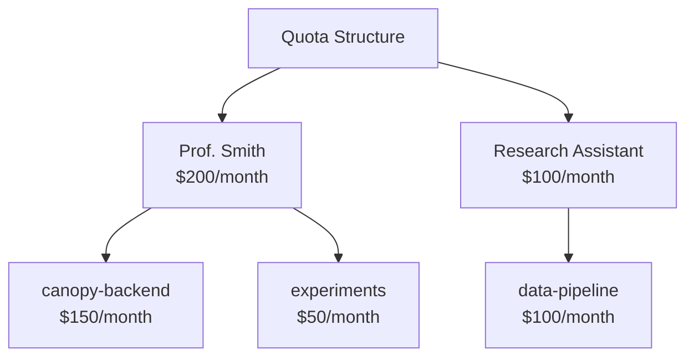

# WIP 

# 📊 사용량 & Observability

> 📊 **페르소나 포커스: 오너 / 회계 담당자** — "큰 GPU 비용에는 큰 비용 추적의 책임이 따른다." 여러분은 클라우드 청구서를 받고, AI 비용이 3개월 만에 0달러에서 5만 달러로 늘어난 이유를 경영진에게 설명해야 하는 사람입니다. 이 레슨은 여러분의 생존 가이드입니다.

---

## 🎯 배울 내용

이 레슨에서는 MaaS의 observability와 비용 관리 측면을 살펴봅니다:

* 📈 시스템 전체 사용량 지표 보기
* 💰 비용 추적과 차지백(chargeback) 구현하기
* 🚨 쿼터와 알림 설정하기
* 📋 컴플라이언스를 위한 감사 로그 검토하기

---

## 🤔 Observability가 중요한 이유

상황을 그려봅시다:

**1개월째:** "AI 비용이 500달러네. 별거 아니군!"

**3개월째:** "AI 비용이 15,000달러라고? 잠깐, 무슨 일이지?"

**6개월째:** "AI 비용이 50,000달러야. 누가 이런 거야?!"

[Image: Chart showing exponential AI cost growth with panicked stick figure at each milestone]

Observability가 없으면, AI 도입은 예산을 집어삼키는 블랙홀이 됩니다. Observability가 있으면, 다음을 할 수 있습니다:

* ✅ *누가* *무엇을* 사용하는지 알기
* ✅ 비용을 사용자와 애플리케이션에 귀속시키기
* ✅ 문제가 되기 전에 통제 불능 사용량을 발견하기
* ✅ 모델 투자에 대해 데이터 기반 의사결정을 하기

---

## 📈 시스템 전체 지표 대시보드

관리자로서, Analytics 대시보드에 접근할 수 있습니다.

### Analytics 접근하기

1. 관리자로 로그인합니다
2. 사이드바에서 **Analytics**로 이동합니다

[Image: Analytics dashboard showing:
- Header with date range picker
- Summary cards: Total Requests (152.4K), Total Tokens (8.2M), Active Users (47), Est. Cost ($1,247)
- Large line chart: "Usage Over Time" with toggles for Requests/Tokens/Cost
- Bar chart: "Top Users" showing top 10 by usage
- Pie chart: "Usage by Model" showing distribution]

### 핵심 지표

| 지표 | 보여주는 것 | 중요한 이유 |
|--------|---------------|----------------|
| **Total Requests** | 발생한 API 호출 수 | 활동 수준, 도입 추적 |
| **Total Tokens** | 입력 + 출력 토큰 | 실제 리소스 소비량 |
| **Active Users** | 기간 내 고유 사용자 수 | 도입 범위 |
| **Estimated Cost** | 토큰 가격에 기반한 금액 | 예산에 미치는 영향 |
| **Avg. Latency** | 응답 시간 | 서비스 품질 |
| **Error Rate** | 실패한 요청 비율 | 서비스 안정성 |

### 필터링 및 드릴다운

대시보드는 강력한 필터링을 지원합니다:

```
Filter by:
├── Date Range: Last 7 days, 30 days, custom
├── Model: granite-8b, llama-3-70b, all
├── User: Specific user or all
└── API Key: Specific key or all
```

[Image: Filter panel showing dropdown selections for each filter type]

---

## 👥 사용자별 사용량

누가 가장 많은 토큰을 사용하는지 알고 싶으신가요?

### 상위 사용자 리포트

**Analytics → Users**로 이동합니다:

[Image: Users analytics table showing:
- Columns: Username, Requests, Tokens, Est. Cost, Avg. per Request, Trend
- Sortable columns (click to sort by any column)
- Sparkline charts in Trend column showing usage pattern
- "Export" button for CSV download]

### 사용자 심층 분석

사용자를 클릭하면 상세한 사용량을 볼 수 있습니다:

```
Prof. Smith
├── Total Requests: 12,345
├── Total Tokens: 2.1M
├── Estimated Cost: $145.67
├── Top Model: granite-8b (89%)
├── Peak Usage Time: 2-4 PM (office hours?)
├── Trend: ↑ 23% vs last month
└── API Keys: canopy-prod, research-experiments
```

### 이상 패턴 식별하기

문제를 나타낼 수 있는 패턴을 찾아보세요:

| 패턴 | 가능한 원인 | 조치 |
|---------|---------------|--------|
| 🚀 급격한 증가 | 새 프로젝트 또는 폭주하는 스크립트 | 사용자와 함께 조사 |
| 📈 꾸준한 증가 | 도입이 잘 되고 있다는 뜻! | 용량 계획 수립 |
| 🌙 야간 사용량 | 예약된 작업 또는... 채굴? | 승인된 것인지 확인 |
| ⚠️ 높은 오류율 | 통합 문제 | 지원 제공 |

---

## 🤖 모델별 사용량

어떤 모델이 인기 있는지 이해하면 용량 계획에 도움이 됩니다.

### 모델 사용량 리포트

**Analytics → Models**로 이동합니다:

[Image: Models analytics showing:
- Table: Model Name, Requests, Tokens, Cost, Avg Latency
- Bar chart comparing model usage
- Trend lines for each model over time]

### 모델 경제성

각 모델에 대해 "단위 경제성(unit economics)"을 확인할 수 있습니다:

```
granite-8b:
├── Total Requests: 89,234
├── Total Tokens: 5.2M
├── Revenue (internal chargeback): $867
├── GPU Cost (estimated): $200
└── Margin: $667 (77%)

llama-3-70b:
├── Total Requests: 12,456
├── Total Tokens: 3.0M
├── Revenue (internal chargeback): $1,245
├── GPU Cost (estimated): $800
└── Margin: $445 (36%)
```

> 💡 **인사이트:** 더 큰 모델은 실행 비용이 더 많이 듭니다. 사용자가 추가적인 능력을 필요로 하지 않는다면, 더 작은 모델로 안내하세요.

---

## 💰 비용 추적 & 차지백(Chargeback)

여러분의 조직이 내부 비용 할당을 사용한다면, MaaS가 필요한 데이터를 제공합니다.

### 차지백이란?

**차지백(Chargeback)** = 공유 리소스 사용에 대해 내부 부서에 비용을 청구하는 것.

AI 비용이 "IT 일반"에 묻혀 있는 대신, 비용을 귀속시킬 수 있습니다. LiteMaaS는 사용자별, API 키별로 사용량을 추적하며, 이를 집계해서 비용 할당에 사용할 수 있습니다:

```
Monthly AI Costs: $1,500

Breakdown by User:
├── Prof. Smith:           $145 (10%)
├── Research Bot (API):    $380 (25%)
├── Canopy Prod (API):     $650 (43%)
├── Dev Team Users:        $325 (22%)
```

> 💡 **팁:** 수동으로 부서를 귀속시키기 쉽게 하려면 설명적인 API 키 이름(예: `cs-dept-canopy` 또는 `library-assistant`)을 사용하세요. 팀 단위 그룹화는 향후 LiteMaaS 릴리스에서 계획되어 있습니다.

이렇게 하면 사용자들이 불필요한 사용에 대해 다시 생각하게 됩니다! 💸

### 사용량 리포트 생성하기

1. **Analytics → Reports**로 이동합니다
2. **Usage Report**를 선택합니다
3. 결제 기간(월, 분기)을 선택합니다
4. 그룹화 방식(사용자별 또는 API 키별)을 선택합니다
5. **Generate**를 클릭합니다

[Image: Usage report showing:
- Period: November 2024
- Table with columns: User/API Key, Total Tokens, Cost, % of Total
- Pie chart visualization
- "Export to PDF" and "Export to CSV" buttons]

### 차지백 모범 사례

| 사례 | 이유 |
|----------|-----|
| 설명적인 API 키 이름 사용 | 귀속을 더 명확하게 만듦(예: `cs-dept-canopy`) |
| 월간 리포트에 포함 | 이해관계자들이 계속 정보를 받도록 함 |
| 사용자 예산 설정 | 책임 소재를 만듦 |
| 분기별 검토 | 트렌드를 조기에 발견 |

---

## 🚨 쿼터와 알림

사전 예방적인 비용 통제가 사후 대응적인 예산 공황보다 낫습니다.

### 쿼터 설정하기

LiteMaaS는 사용자 및 API 키 수준에서 쿼터를 지원합니다:



> 💡 **참고:** 조직 전체 및 팀 단위 쿼터는 향후 릴리스에서 계획되어 있습니다.

### 알림 설정하기

**Settings → Alerts**로 이동합니다:

| 알림 유형 | 트리거 | 조치 |
|------------|---------|--------|
| **Usage Warning** | 예산의 80% | 이메일 알림 |
| **Usage Critical** | 예산의 95% | 이메일 + 앱 내 배너 |
| **Budget Exceeded** | 예산의 100% | 선택적: 요청 차단 |
| **Anomaly Detected** | 평소의 3배 사용량 | 관리자에게 이메일 |

[Image: Alert configuration page showing:
- Table of alert rules
- Each row: Alert Type, Threshold, Recipients, Status (enabled/disabled)
- "Add Alert" button]

### 예산 알림 설정하기

1. **Settings → Alerts**로 이동합니다
2. **Add Alert**를 클릭합니다
3. 설정합니다:
   - **Name:** "Prof Smith 80% Warning"
   - **Scope:** User → Prof. Smith
   - **Threshold:** 월 예산의 80%
   - **Action:** 사용자에게 이메일 발송
4. **Save**를 클릭합니다

### 쿼터 적용 옵션

예산이 소진되면, 다음과 같은 선택지가 있습니다:

| 모드 | 동작 | 적합한 대상 |
|------|----------|----------|
| **Soft Quota** | 경고를 로그에 기록하고 요청은 계속 허용함 | 프로덕션 워크로드 |
| **Hard Quota** | 요청을 차단하고 429를 반환함 | 테스트 환경, 공유 계정 |
| **Grace Period** | 10% 초과까지는 허용하고, 그 이후 차단함 | 두 방식의 균형 |

---

## 📋 감사 로그

컴플라이언스와 보안을 위해, LiteMaaS는 모든 것을 로그로 기록합니다.

### 무엇이 기록되는가

| 이벤트 유형 | 예시 |
|------------|---------|
| **Authentication** | 사용자 로그인, 로그아웃, 실패한 시도 |
| **API Key Management** | 생성, 취소, 재생성 |
| **Admin Actions** | 역할 변경, 예산 수정 |
| **API Requests** | 모델, 사용자, 타임스탬프(내용은 기록하지 않음!) |
| **Configuration Changes** | 모델 활성화/비활성화, 가격 업데이트 |

### 감사 로그 보기

**Settings → Audit Logs**로 이동합니다:

[Image: Audit logs table showing:
- Columns: Timestamp, User, Action, Target, Details, IP Address
- Filter bar for date range and event type
- Example entries showing various actions
- "Export" button for compliance reports]

### 컴플라이언스 사용 사례

| 요구사항 | MaaS가 도와주는 방법 |
|-------------|----------------|
| **누가 무엇에 접근했는가?** | 감사 로그가 모든 API 키 사용량을 보여줌 |
| **무엇이 변경되었는가?** | 설정 변경이 로그로 기록됨 |
| **사용자 오프보딩** | 키가 취소되고 접근 권한이 제거되었는지 확인 |
| **비용 귀속** | 누가 무엇을 지출했는지에 대한 완전한 기록 |

---

## 🎮 실습

### 실습 1: 사용량 리포트 생성하기

1. Analytics → Reports로 이동합니다
2. 지난 7일간의 사용량 리포트를 생성합니다
3. 토큰 소비량 기준 상위 3명의 사용자를 파악합니다
4. 리포트를 CSV로 내보냅니다

### 실습 2: 예산 알림 설정하기

1. Settings → Alerts로 이동합니다
2. 자신의 예산 50%에 도달했을 때를 위한 알림을 만듭니다
3. 알림을 트리거하기 위해 API 호출을 몇 번 합니다
4. 알림을 받는지 확인합니다

### 실습 3: 감사 로그 검토하기

1. Settings → Audit Logs로 이동합니다
2. "API Key" 이벤트만 표시하도록 필터링합니다
3. 자신의 API 키가 언제 생성되었는지 찾습니다
4. 지난 24시간의 감사 로그를 내보냅니다

### 실습 4: 차지백 시뮬레이션 만들기

1. MaaS를 사용하는 세 개의 부서가 있다고 상상해보세요
2. 사용량 데이터를 기반으로, 각 부서가 다음 가격에서 얼마를 지불해야 하는지 계산해보세요:
   - 1K 토큰당 $0.01 (예산형 가격)
   - 1K 토큰당 $0.10 (엔터프라이즈 가격)
3. 어떤 부서가 예산에 대한 대화가 필요할까요?

---

## 🧪 지식 확인

<details>
<summary>❓ AI 플랫폼의 지속가능성을 위해 차지백이 왜 중요한가요?</summary>

✅ **답:** 차지백은 책임 소재를 만듭니다. 부서들이 자신의 사용량에 대해(내부적인 것이라도) 비용을 지불하면, 그들은:
- 불필요한 사용에 대해 다시 생각하게 됩니다
- 자신의 애플리케이션을 최적화합니다
- 실제로 가치를 제공하는 것에 투자합니다
- 자신들이 만든 높은 비용에 대해 "IT"를 탓할 수 없습니다
</details>

<details>
<summary>❓ soft 쿼터와 hard 쿼터의 차이는 무엇인가요?</summary>

✅ **답:**
- **Soft quota:** 경고를 로그에 기록하지만 요청은 계속 허용합니다. 가용성이 중요한 프로덕션에 적합합니다.
- **Hard quota:** 예산이 소진되면 429 오류로 요청을 차단합니다. 테스트/개발 환경에 적합합니다.
</details>

<details>
<summary>❓ 한 사용자가 API 호출이 갑자기 동작하지 않는다고 불만을 제기합니다. 어떻게 조사해야 할까요?</summary>

✅ **답:** 다음 순서로 확인하세요:
1. **감사 로그:** 해당 사용자의 키에 대한 취소 이벤트가 있는가?
2. **예산 상태:** 쿼터에 도달했는가?
3. **모델 상태:** 사용 중인 모델이 여전히 활성화되어 있는가?
4. **오류 로그:** 어떤 오류 코드를 받고 있는가?
</details>

---

## 📊 회계 담당자의 도구함: 요약

MaaS 비용 관리를 위한 빠른 참고표입니다:

| 작업 | 이동할 위치 |
|------|-------------|
| 전체 사용량 보기 | Analytics → Dashboard |
| 상위 소비자 찾기 | Analytics → Users |
| 비용 리포트 생성 | Analytics → Reports → Chargeback |
| 지출 한도 설정 | Settings → Budgets |
| 사전 알림 받기 | Settings → Alerts |
| 문제 조사하기 | Settings → Audit Logs |

---

## 🎯 달성한 것

오너/회계 담당자로서, 이제 여러분은:

* ✅ 시스템 전체 사용량 지표를 살펴봤습니다
* ✅ 비용 추적과 차지백을 이해했습니다
* ✅ 사전 예방적 통제를 위한 쿼터와 알림을 설정했습니다
* ✅ 컴플라이언스를 위해 감사 로그를 검토했습니다

[Image: Achievement badge with "📊 Cost Controller" text and subtitle "No more surprise cloud bills — you're in control!"]

---

## 🎯 다음 단계

오너, AI 엔지니어, 서비스 관리자, 소비자 — 모든 각도에서 MaaS를 살펴봤습니다. 이제 모든 것을 하나로 모을 시간입니다!

Canopy 애플리케이션을 LiteMaaS에 연결해서 전체 그림이 완성되는 것을 지켜봅시다.

**[Canopy Integration](./6-canopy-integration.md)로 계속하기** →
